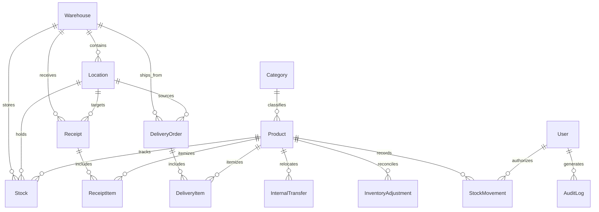

# StockSense — Modular Inventory Management System

> **"Know Your Stock. Control Your Flow."**
> A production-grade SaaS inventory management application designed to digitize and centralize stock operations across multiple warehouses, locations, and teams.

---
## Team Contribution
Hackathon development branch.

## Project Status

🚧 Currently under active development for the hackathon.

## Development Workflow

1. Create a feature branch.
2. Make and test changes.
3. Commit the changes.
4. Push the branch.
5. Create a pull request for review.

## Team Development

This project is being developed collaboratively using Git and GitHub.

## 🚀 Key Highlights & Architectural Principles

- **True Multi-Warehouse & Location Hierarchy**: Physical stock is never floating. Stock is strictly mapped as `Product -> Warehouse -> Location -> Stock Quantity`.
- **Zero Silent Mutations**: Every inventory change (Receipt, Delivery, Transfer, Adjustment) atomically generates an immutable **Stock Movement Ledger** record and a **System Audit Log**.
- **Negative Stock Protection**: Configurable system setting to prevent dispatching or transferring more quantity than physically available.
- **Enterprise SaaS Ergonomics**: Global instant search (`Cmd+K`), responsive navigation drawer, toast notifications, confirmation modals, RFC-4180 compliant CSV export, and accessible visual hierarchy.

---

## 🛠 Tech Stack

- **Framework**: [Next.js 14 (App Router)](https://nextjs.org/)
- **Language**: [TypeScript](https://www.typescriptlang.org/)
- **Styling**: [Tailwind CSS](https://tailwindcss.com/)
- **Database ORM**: [Prisma 5.22.0](https://www.prisma.io/)
- **Database Engine**: SQLite (`file:./dev.db`) — self-contained, zero external infrastructure required
- **Data Visualization**: [Recharts](https://recharts.org/)
- **Icons**: [Lucide React](https://lucide.dev/)
- **Authentication**: HMAC SHA-256 session token cookies with Role-Based Access Control (`INVENTORY_MANAGER` vs `WAREHOUSE_STAFF`)

---

## 📦 Core Feature Modules

### 1. Multi-Warehouse & Location Management (`/warehouses`, `/locations`)
- **Warehouses**: Multi-facility management (e.g., Main Warehouse, Production Facility, Finished Goods Depot).
- **Locations**: Granular location codes (Receiving Docks, Storage Aisles, Dispatch Bays, Production Floors, Damaged Area) with dedicated capacities and location types.

### 2. Product Catalog & Real-Time Stock Engine (`/products`, `/products/[id]`)
- Product SKUs, barcodes, categories, unit of measure (UOM), cost/selling prices.
- 4-tab product deep dive:
  1. **Overview & Metrics**: Stock stats, valuations, pricing margins.
  2. **Location Stock Matrix**: Exact quantity and reserved stock across every warehouse shelf.
  3. **Movement History**: Chronological timeline of all goods moving in, out, or between locations.
  4. **Reorder Rules**: Configurable minimum stock thresholds and reorder amounts.

### 3. Goods Receipt (`/operations/receipts`)
- Record vendor shipments against purchase orders.
- Atomic validation increases destination location stock, marks receipt `DONE`, and records a positive movement on the ledger.

### 4. Customer Deliveries (`/operations/deliveries`)
- 3-step warehouse fulfillment workflow: **Pick** -> **Pack** -> **Validate**.
- Deducts stock from specific source location bins and prevents shipping unavailable inventory.

### 5. Internal Stock Transfers (`/operations/transfers`)
- Transfer stock between locations within the same warehouse or across different warehouses.
- Atomic transaction decrements source location and increments destination location, preserving total company stock balance.

### 6. Cycle Counts & Inventory Adjustments (`/operations/adjustments`)
- Physical count discrepancy reconciliation.
- Records variance (`difference = countedQuantity - systemQuantity`), categorization (`DAMAGED`, `LOST`, `FOUND`, `COUNTING_ERROR`, `EXPIRED`), and automatically syncs physical balance.

### 7. Immutable Stock Movement Ledger (`/operations/moves`)
- Complete audit trail of all inventory movement events.
- Filter by operation type (`RECEIPT`, `DELIVERY`, `TRANSFER`, `ADJUSTMENT`), warehouse, and search term.
- One-click **Export to CSV** supporting standard RFC-4180 formats.

### 8. System Audit Logs (`/audit`)
- Searchable audit log capturing every administrative action, entity modification, and user timestamp.
- Built-in JSON inspector modal to compare previous and updated records.

### 9. Interactive Dashboard (`/dashboard`)
- Real-time operational KPIs:
  - Total SKUs in Catalog
  - Total Stock Quantity on Hand
  - Total Inventory Valuation
  - Low Stock & Critical Out-of-Stock Alerts
  - Active Pending Operations (Draft/Picking)
- Visual analytics:
  - 7-day, 30-day, and 90-day movement velocity chart (AreaChart)
  - Category stock breakdown (Donut PieChart)
  - Warehouse capacity utilization (Horizontal BarChart)
  - Urgent Low Stock action items with direct reorder navigation

### 10. Role-Based Access Control & Mock OTP Auth Flow (`/login`, `/signup`, `/forgot-password`)
- **Inventory Manager**: Unrestricted access to system settings, audit logs, reorder rules, and warehouse configurations.
- **Warehouse Staff**: Streamlined view focused on operational picking, packing, receiving, and transfers.
- **OTP Password Recovery**: 4-step interactive OTP reset flow with countdown timer and demo OTP autofill.

---

## 🔐 Demo Credentials

Quick one-click login buttons are pre-configured on the login screen, or you can enter:

| Role | Email | Password | Permissions |
| :--- | :--- | :--- | :--- |
| **Inventory Manager** | `manager@stocksense.com` | `manager123` | Full administrative & settings access |
| **Warehouse Staff** | `staff@stocksense.com` | `staff123` | Inventory operations (Receipts, Deliveries, Transfers) |
| **Alternate Admin** | `ankit@stocksense.com` | `password123` | Full access |

---

## ⚡ Quick Start & Development

### 1. Install Dependencies
```bash
npm install
```

### 2. Initialize Database & Seed Demo Data
```bash
# Push schema to SQLite database
npm run db:push

# Populate realistic demo inventory, warehouses, products, and movements
npm run db:seed
```

### 3. Start Development Server
```bash
npm run dev
```
Open [http://localhost:3000](http://localhost:3000) in your browser.

### 4. Run End-to-End Test Suite
To verify the complete 7-step inventory lifecycle (Receipt -> Transfer -> Delivery -> Adjustment -> Negative Stock Guard -> Ledger -> Audit):
```bash
npm run test:e2e
```

### 5. Build for Production
```bash
npm run build
npm run start
```

---

## 🗄️ Database Architecture (`prisma/schema.prisma`)



---

## 🛡️ License
Private SaaS Application - All rights reserved.
